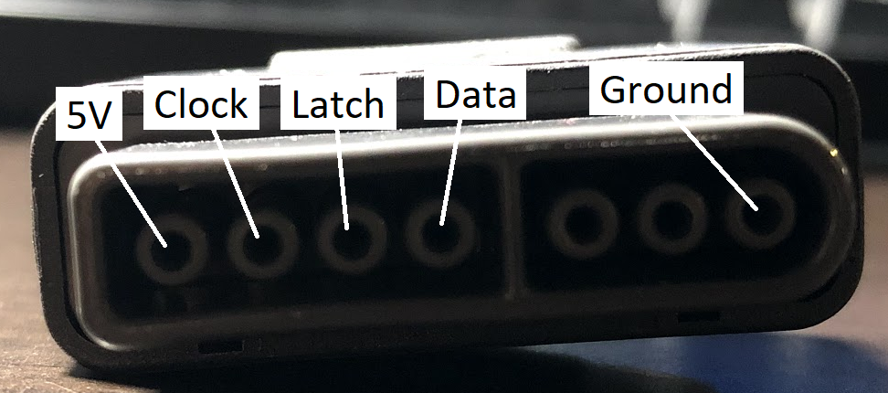

# Arduino SNES Controller Library

A library that allows you to connect SNES controllers to an Arduino.

This project is heavily based on a sketch I found on [this post on Hackaday.io.](https://hackaday.io/project/7498-snes-controller-arduino-adapter) I originially modified it to play PC games such as Celeste, VVVVVV, and Cuphead with a genuine SNES controller and an Arduino Leonardo, except it was finnicky and hard to understand. In addition, the high-level structure of the library is inspired by the [PSX Library](https://playground.arduino.cc/Main/PSXLibrary/) which I had also used to play PC games.

If you don't know how to install an Arduino library, refer to [this guide](https://www.arduino.cc/en/pmwiki.php?n=Guide/Libraries) for more information. Their explanation is better than anything I can possibly write.

## Wiring

The SNES controller port has 7 pins, 5 of which are used (see below). You can stick wires in to the pins, but getting a good connection is *really* hard. Your best bet to getting a good connection is to cut the cable and solder jumper leads. (If you're like me and don't want to mutilate genuine hardware, you can buy a knockoff extension cord)



## Example Usage
```cpp
#include <SNES.h>

// SNES controller with data on pin 7, data on pin 9, latch on pin 8
SNESController snes(7, 9, 8);

void setup()
{
	Serial.begin(115200);

	// initialize SNES controller
	snes.initialize();

	// buttons are longs
	long btn = SNES_B_BUTTON;
}

void loop()
{
	delay(1000);

	// read controller buttons
	snes.update();


	// check inputs with pressed, andPressed, orPressed

	if (pressed(SNES_A_BUTTON))
	{
		Serial.println("A");
	}

	if (andPressed({SNES_L_BUTTON, SNES_R_BUTTON}))
	{
		Serial.println("L + R");
	}

	if (orPressed({SNES_DPAD_UP, SNES_DPAD_DOWN, SNES_DPAD_LEFT, SNES_DPAD_RIGHT}))
	{
		Serial.println("D-pad");
	}


	// or work with the data in binary form if you prefer that

	long data = snes.getData();

	if (data & SNES_START_BUTTON)
	{
		Serial.println("Start");
	}
}
```
